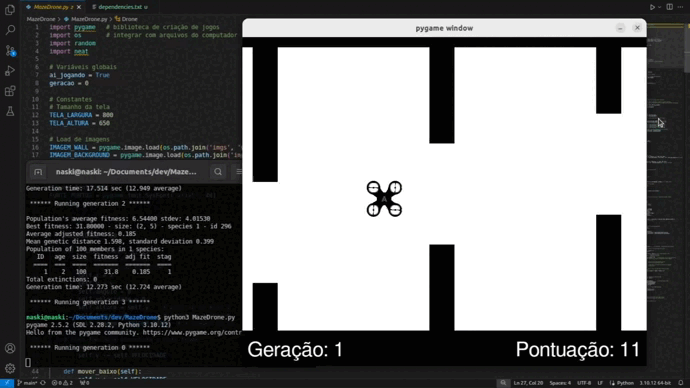

# MazeDrone

-orange)

-blue)

Projeto pessoal de desenvolvimento de uma rede neural gerada por um algoritmo evolucionário, capaz de controlar um drone em meio a um labirinto. 

    

## Dependências

- [NEAT](https://neat-python.readthedocs.io/en/latest/neat_overview.html) (NeuroEvolution of Augmenting Topologies) is an evolutionary algorithm that creates artificial neural networks. 
- [Pygame](https://pypi.org/project/pygame/) is a free and open-source cross-platform library for the development of multimedia applications like video games using Python. 